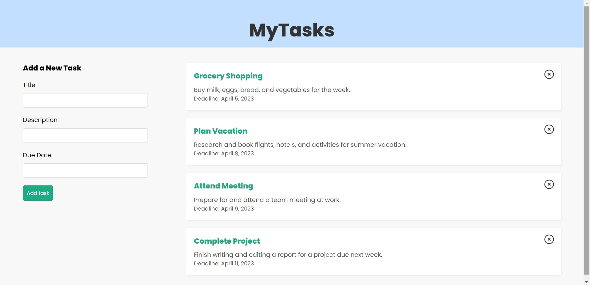

# To-Do List App

This fullstack to-do list app is built with the MERN stack, consisting of React for the frontend, Express.js and Node.js for the backend, and MongoDB Atlas as the database. Users can add and delete tasks, which have a title, description, and due date. Additionally, plans are underway to incorporate an edit functionality that will enable users to update existing tasks easily.

The app is deployed on Render as a static site, accessible at https://todo-app-static-site.onrender.com/.

